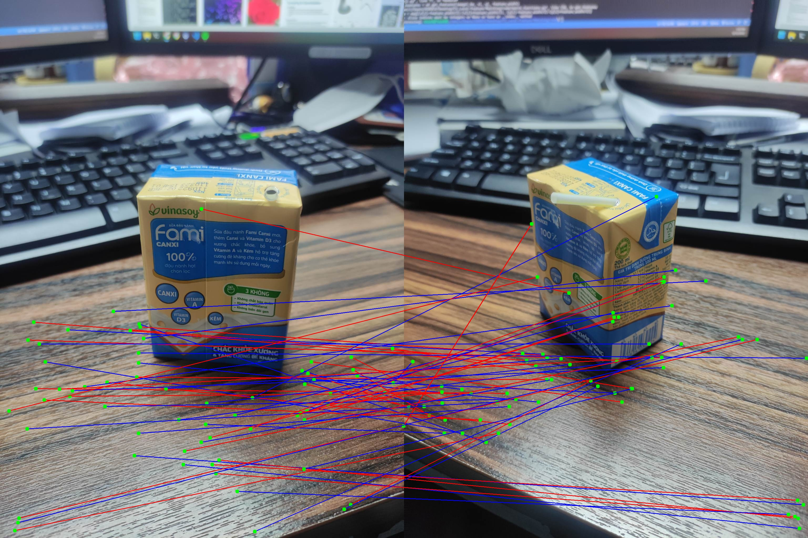

# corresponding-point-harris-method
Harris Corner Detection and Matching in two same images with different views

In this project we're going to implement corresponding point detection with haris corner detection method

the estimated time for running the code is about 10 min and during the runtime the progress will be shown , also the results will be saved in the results folder

INPUT: two images with name im01.jpg and im02.jpg wich are taken from a book with two different viewpoints

here is some more information about haris method if you are interested: https://en.wikipedia.org/wiki/Harris_Corner_Detector

Results :

